# Brave Heart browser extension

  * [Download](#Download)
  * [Discuss](#Discuss)
  * [How to use it](#How-to-use-it)
    * [Entry actions](#Entry-actions)
    * [Settings](#Settings)
    * [Contributing](#Contributing)
      * [Amounts](#Amounts)
      * [Manual entries](#Manual-entries)
      * [Pay](#Pay)
    * [Past periods](#Past-periods)
  * [Producers](#Producers)
    * [Header](#Header)
    * [Content](#Content)
    * [PayButton](#PayButton)
    * [YouTube](#YouTube)
    * [Read.cash](#Read-cash)
    * [Twitter](#Twitter)
  * [Privacy](#Privacy)
  * [FAQ](#FAQ)

A chrome extension to directly reward web producers with no trusted intermediaries.

The extension monitors the pages you're visiting and looks for Bitcoin Cash addresses in them. The goal is to provide a summary of the pages, channels, or users from which you consume the most content and allow you to contribute to them proportionally in an easy way. This is similar to (and inspired by) Brave Rewards but with the difference that:

  * Addresses are collected directly from the pages you visit;
  * Producers don't have to register to any service;
  * It uses Bitcoin Cash;
  * Producers receive 100% of your contribution;

## Download

You can get it from the corresponding web stores.

<table>
  <tr>
    <td>
      <a href="https://chrome.google.com/webstore/detail/brave-heart/pilfdbhihpfofbaeebffenllffmjnpei">
        
      </a>
    </td>
  </tr>
</table>

You can also download the extension directly from the Github releases.

  * [https://github.com/m4ktub/brave-heart/releases](https://github.com/m4ktub/brave-heart/releases)

## Discuss

You can join the telegram group to report bugs, make suggestions, or simply ask questions and hangout. You can also follow the twitter account for the latest news and share the extension with others.

  *  [https://t.me/braveheartextension](https://t.me/braveheartextension)
  *  [https://twitter.com/BraveExtension](https://twitter.com/BraveExtension)

## How to use it

After installing the extension is you just need to browse the web as usual. The extension monitors the websites, articles, videos, tweets, and other contents you read over the Internet and keeps track of the time you spend in each place.

You can check which of the sites you visit support donations by the extension by clicking the extension button.

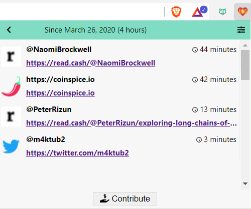

### Entry actions

In the popup, when you hover each entry a couple of actions are shown.

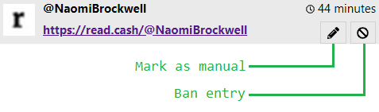

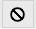 Sometimes the extension picks up an article or author you don't want to consider. Banning the entry will remove that entry and it wont appear again even if you visit that page another time. The entry can be restored from the [settings](#Settings).

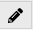 There are also websites, for projects you like, but that don't produce regular content. This means that visits are infrequent or you never take very long on those websites which results in only a few seconds of accumulated time and a smaller donation than wanted. Marking the entry as manual allows to ignore the time spent there and manually set the donation when [contributing](#Contributing).

### Settings

 You can access the extension options through the settings icon shown in the popup's header. As for any other extension, you can also right click the extension button and choose "Options" from the menu. The options are grouped together into sections.

**Contribute**: Choose the currency to use when presenting fiat values. This is particularly important when figuring amount of Bitcoin Cash to pay.

**Exclusions**: Shows the list of websites or pages that have been excluded from the popup. When you hover each excluded item you can choose to restore it with the 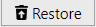 button. This will make the entry reappear in the popup.

### Contributing

The extension does not currently enforce periodic contributions, that is, you don't have to contribute weekly or monthly. Instead, whenever you feel you've accumulated enough time, you can simple choose to contribute by using the 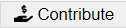 button at the bottom of the extension's popup. The contribution page will open.

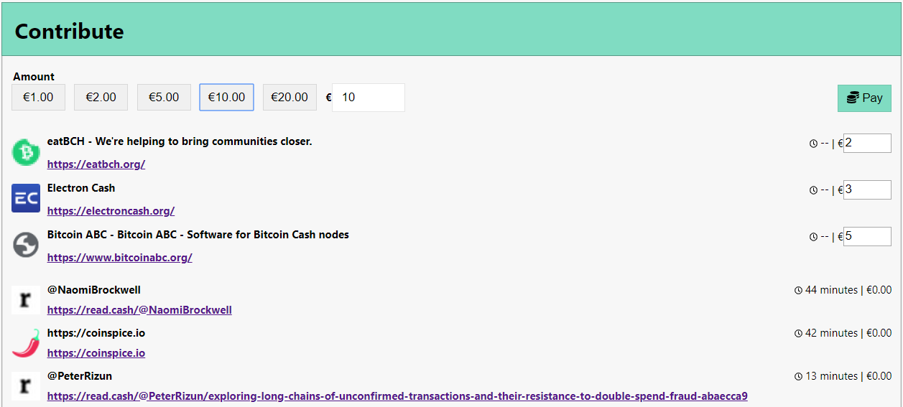

#### Amounts

The total amount to contribute can be set with the controls at the top of the page. There are a series of preset values that you can simply click to choose. Nevertheless any value can be manually edited to the right. The value you choose will be the total value to pay, that is, the value will be split between entries for which you manually set the value and entries that are calculated proportionally to the time spent there.

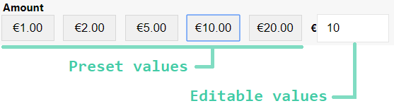

#### Manual entries

All entries you've marked as manual will appear at the top so that you can explicitly set the fiat value to donate. The value you enter for all manual entries will be deducted from the total contribution amount and the remaining will be split between all the other automatic entries proportionally.

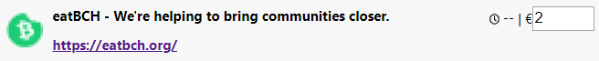

#### Pay

After choosing all values you simple need to click the pay 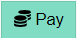 button. This will show a QR code that you can use to pay with a mobile wallet. Just scan the QR code and complete the transaction as normal.

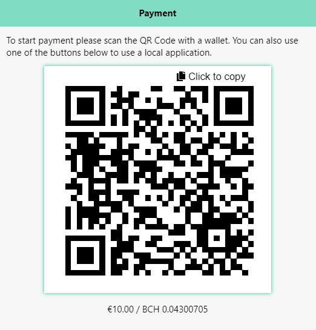

If you want to use another wallet in your computer, like Badger Wallet or Electron cash, you'll need to copy the address with the copy button 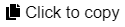 and switch that application to make the payment. To ensure the payment is processed correctly, please leave the contribute page open. When a payment is received you'll see a confirmation for a few seconds and the QR code will disappear.

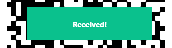

### Past periods

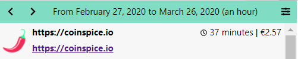

After a few contributions, you can navigate to previous periods by using the navigation arrows 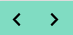 in the popup's header. You'll be able to review the sites you've visited as well as the amounts paid for each entry, during that period. When the value was manually set instead of proportional to the time spent it will also be marked with the pencil  icon.

## Producers

If you're a content producer it takes very little effort to make your content detected by the extension. In general, you just need to place your Bitcoin Cash address or Cash Account correctly for it to be detected. Below are the ways you can use. 

### Header

If you're the author or designer of the website you can include an extra meta propery to the header. You can use a different address for each page to separate contributions per page.

```html
<meta name="bch:donate" content="qz4jfsrfh4u0nr5mrzdnhxrsanw5f4plaqq6px4r72">
```

### Content

Bitcoin Cash addresses present in the page's content are ignored unless the author marks them as a donation address. For that, you need the ability to add or change the page HTML and either set the id or the class, of any element containing the address, to "donation". If you set the class, make sure the element is a `div`.

```html
<!-- example 1 -->
<a id="donation">bitcoincash:qz4jfsrfh4u0nr5mrzdnhxrsanw5f4plaqq6px4r72</a>

<!-- example 2 -->
<div class="donation">
  <a>bitcoincash:qz4jfsrfh4u0nr5mrzdnhxrsanw5f4plaqq6px4r72</a>
</div>
```

### PayButton

If you integrate a [Pay Button](https://paybutton.org/) in your page, that will be detected by the extension. Any parameter except the address will be ignored.  

### YouTube

Add the Bitcoin Cash address anywhere in the video's description.

### Read.cash

Nothing needs to be done for read.cash. The extension will pick up the same address where you receive every tip. Note that any time spent commenting on your article will count as time spent on your article. You may benefit from answering some comments and promoting engagement. 

### Twitter

Add your Bitcoin Cash address or Cash Account to your profile description. You can also use your location or website to save space in the description. The extension will only count your tweets if users open the tweet explicitly and not when seen in the feed. You may benefit from sharing a direct link to the tweet or promoting engagement with media.

## Privacy

The extension will be active on every site you visit. No personal information or information from you browser or device is ever collected or transmitted. The only information collected by the extension are the page's title, the page's URL, and one Bitcoin Cash address associated with the page. When visiting websites the extension may perform additional requests to retrieve account information or the Bitcoin Cash address for the content's author. All that information, together with the time spent on the page, is stored in the browser's local storage which may be accessible to other applications installed in your device. 

The extension uses the following services:

  * https://rest.bitcoin.com
  * https://index-api.bitcoin.com
  * https://bitsocket.bch.sx

Your IP may be recorded by those websites. Due to the translation of Cash Accounts to Bitcoin Cash addreses, it may be possible for Bitcoin.com keep track of the authors you consume the most. Besides this information, only public information (eg. Bitcoin Cash addresses and transactions) are ever transmitted and it's important that you ensure the privacy of the generated change.

## FAQ

There are no frequently asked questions yet.

<div>
    <script src="https://paybutton.cash/pre-release/v0.1/js/paybutton.min.js"></script>
    <button
      class="pay-button"
      button-text="Found this helpful?"
      button-text-2="Tip €0.50"
      amount="0.5"
      amount-type="eur"
      address="bitcoincash:qz6tuqwe2xz3rvp9h8zlpjg86x4xmy4u5v48ue2k96"
      success-msg="Thank you!"
    ></button>
  </div>